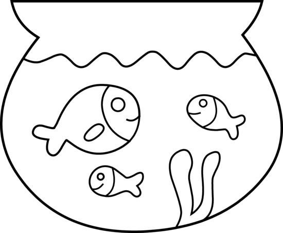

# SafeWheels

## Screenshots
    

# LOGO

# Group PROJECT 
Husky ADAPT repo: please add your team description here!

Project Pages site HuskyADAPT.github.io/<GroupName>	
you can change what's on the website by either changing the markdown file on master or a /docs folder on master

## Screenshots

## Authors
